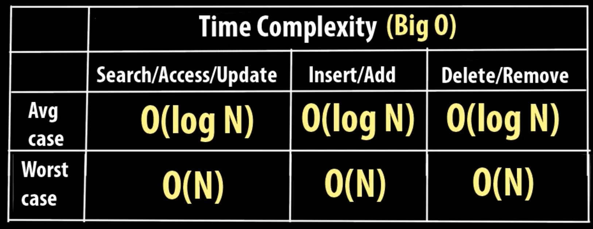

# TREE

* Non linear data structure, b/c it does not store the data in sequential manner.

* Defined as a collection of objects or entities known as nodes that are linked together or simulate hierarchy.

* Each nodes contains some data & the link or reference of other nodes that can be called children.


## Important terms related to Tree.

* **Root Node :** Complete tree is referenced using this node & it does not have any parent.
* **Parent Node :** Immediate predecessor of a node.
* **Child node :** All immediate successor of a node are called child node.
* **Siblings :** Nodes with the same parents.
* **Leaf :** Last node in the tree. There is no node after leaf node.
* **Edge :** Connection between two nodes.
* **Path :** Successive edges from source node to destination node.
* **Degree of a Node :** Equals to number of children of that node.
* **Depth of a Node :** It represents the number of edges from the root node to this node.
* **Height of a Node :** It is the number of edges on the longest path between that node & a leaf.
* **Height of the Tree :** Its the height of root node of that tree.

## Different types of tree.

* General Tree
* Binary Tree
* Binary Search Tree
* AVL Tree
* Spanning Tree
* B Tree
* B+ Tree
* HEAP

## Applications of Tree data structures.

* Used in storing hierarchical data, like organization structure, folder structure, etc..
* Used in storing router-tables in routers.
* Used by Compilers to build Syntax trees.
* Used to implement expression parsers.
* BST is a tree helps in faster search, insert, delete on a sorted data.
* HEAP is a tree implemented using arrays & used to implement priority queues.
* B Tree & B+ Trees are used to implement indexing in databases.

------------------------------------------------------------------------------------------------------

# Binary Tree

* It is a tree data structure in which each nodes can have maximum of 2 children nodes, referenced as left child & right child.

* **Strict / Proper Binary Tree :** Each node have either 0 or 2 child.
* **Complere Binary Tree :**        All levels except last level are completly filled and in the last level all the nodes are filled in left to right fashion.
* **Perfect Binary Tree :**         All the levels of the Tree are completetly filled with 2 children of each nodes.

## Implementation


------------------------------------------------------------------------------------------------------

# Binary Search Tree

* It is a type of a binary tree, in which the values in the left subtrees of every node are smaller & the values in the right subtrees of every node are larger.



## Different Operations on BST.

* Insertion Operation
* Traversal Techniques
    * DFS -> PreOrder, InOrder, PostOrder
    * BFS -> Level Order
* Search Operation
* Deletion Operation

### Insertion Operation

* Pseudo code
```
    TreeNode *newNode = new TreeNode(val)  // Creating a new node in the heap.
    if rootNode is NULL
        Make newNode as rootNode and return.
    else {
        while (rootNode != NULL) {
            if (newNode->value == rootNode->value) {
                Print Duplicate nodes are not allowed and return.
            } else if (newNode->value < rootNode->value) {
                if (rootNode->left)
                    then rootNode = rootNode->left
                else    
                    rootNode->left = newNode
            } else if (newNode->value > rootNode->value) {
                if (rootNode->right)
                    then rootNode = rootNode->right
                else
                    rootNode->right = newNode
            }
        }
    }
```


### Traversal Techniques

* There are two types of traversal
    1. **DFS (Depth first search)** :-> PreOrder, InOrder, PostOrder
    2. **BFS (Breadth first search)** :-> Level order traversal

* PreOrder Traversal Pseudo Code
```
    PreOrderTraversal(rootNode) {
        Print(rootNode->value)
        PreOrderTraversal(rootNode->left)
        PreOrderTraversal(rootNode->right)
    }
```

* InOrder Traversal Pseudo Code
```
    InOrderTraversal(rootNode) {
        InOrderTraversal(rootNode->left)
        Print(rootNode->value)
        InOrderTraversal(rootNode->right)
    }
```

* PostOrder Traversal Pseudo Code
```
    PostOrderTraversal(rootNode) {
        PostOrderTraversal(rootNode->left)
        PostOrderTraversal(rootNode->right)
        Print(rootNode->value)
    }
```

* LevelOrder Traversal Pseudo Code ( Method 1. Using function to print the current level )

```
    LevelOrderTraversal(rootNode) {
        for i=1 to heightOfTheTree {
            PrintCurrentLevel(rootNode, i)
        }
    }

    PrintCurrentLevel(rootNode, level) {
        if rootNode is NULL then return
        
        if (level == 1) {
            Print(rootNode->value)
            return
        }

        PrintCurrentLevel(rootNode->left, level-1);
        PrintCurrentLevel(rootNode->right, level-1);
    }
```

* LevelOrder Traversal Pseudo Code ( Method 1. Using Queue data structure )
```
    LevelOrderTraversal(rootNode) {
        Create an empty queue Q
        Q.insert(rootNode)
        while (Q is not empty) {
            temp = Q.front()
            print(temp->value)
            if rootNode->left then Q.push(rootNode->left)
            if rootNode->right then Q.push(rootNode->right)
        }
    }
```

### Search Operation


### Deletion Operation


    


